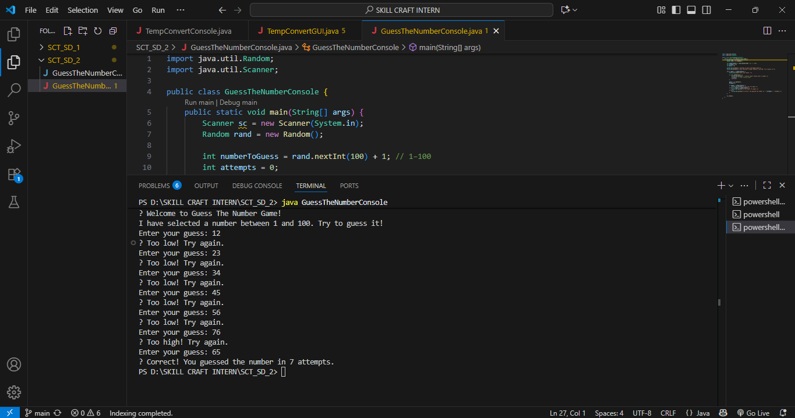
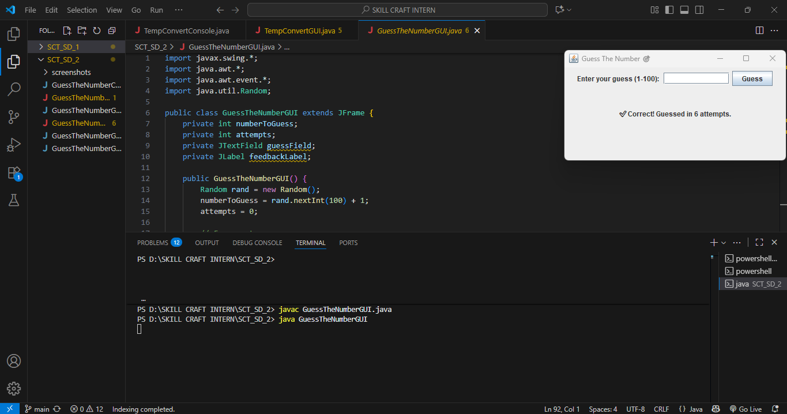
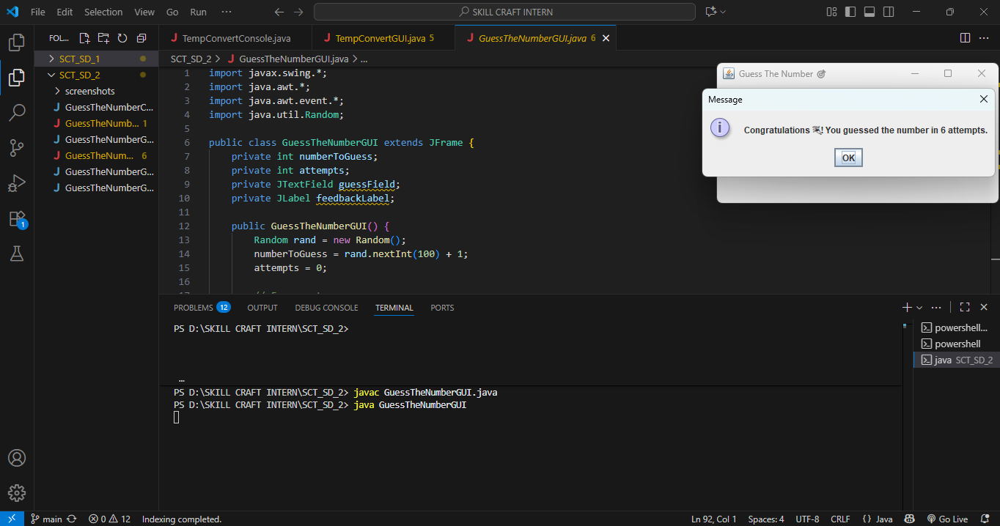

# 🎯 GuessTheNumber – Random Number Guessing Game (Console + GUI)

This project is **Task 02** for the **SkillCraft Technology Software Development Internship (Software Development Track)**.
It’s a fun Java-based guessing game where the program generates a random number, and the user tries to guess it — either via **console** or a **Swing GUI interface**.

---

## 📝 Description

The **GuessTheNumber** game challenges the player to guess a random number between **1 and 100**.
It provides two modes:

* **Console Version** → Classic terminal-based interaction
* **GUI Version** → Swing-powered interactive window with user-friendly design

---

## ✨ Features

* 🔢 Generates random numbers between **1–100**
* 📊 Tracks number of attempts
* ⚠️ Input validation with clear error messages
* 🖥️ **Console Mode** → Simple and quick interaction
* 🎨 **GUI Mode** → Interactive, event-driven interface

---

## 🚀 How to Run

### ▶️ Console Version

```bash
javac GuessTheNumberConsole.java
java GuessTheNumberConsole
```

You will be prompted to guess numbers until you find the correct one.
The program will tell you if your guess is **Too High** or **Too Low** and track your attempts.

---

### 🖼️ GUI Version

```bash
javac GuessTheNumberGUI.java
java GuessTheNumberGUI
```

An interactive Swing window will open.
Enter your guesses in the text field, get instant feedback, and see how many attempts it takes you.

---

## 📸 Screenshots

### Console Output



### GUI Window






---

## 📂 Project Structure

```
SCT_SD_2/
│-- GuessTheNumberConsole.java   # Console version
│-- GuessTheNumberGUI.java       # GUI version                  
│-- screenshots/                 # Screenshots of outputs
```

---

## 🌱 Skills Practiced

* ✅ Java programming fundamentals (`Random`, Loops, Conditions)
* ✅ Swing GUI development & event handling
* ✅ Input validation & error handling
* ✅ Designing user-driven interactive applications
* ✅ Git & GitHub for version control


